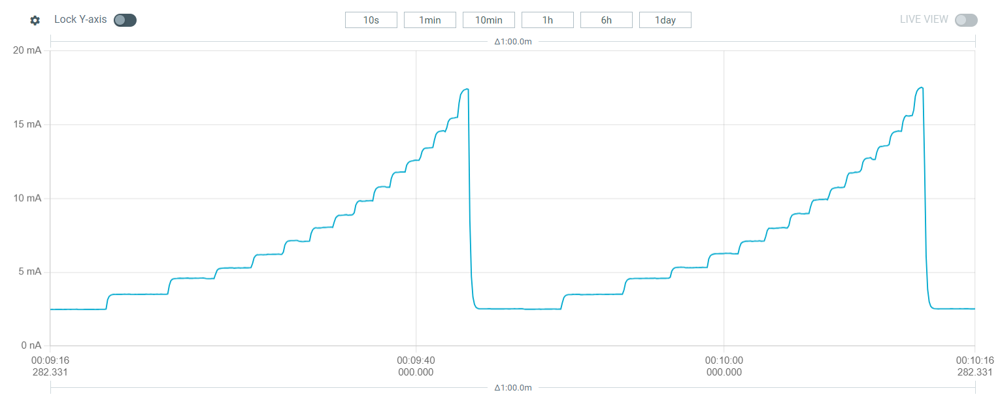

# DMA ADC & op-amp example
Simple example that demonstrates how to configure different PLL multipliers
for the HSI clock source.

## In order to change the PLL multipler value
- first switch the peripheral clock to HSI.
- turn off PLL, set the PLL multiplier value, and turn on PLL
- finally, switch the peripheral clock back to use PLL

## Descriptions
This example cycles through different PLLMUL[3:0] values 0 to 15.
Depending on what chip you are using the PLLMUL value represents different multipliers.
For example, CH32V30x_D8 PLLMUL = 0 = PLL input clock * 2
whereas, CH32V30x_D8C PLLMUL = 0 = PLL input clock * 18
Since the PLL input clock changes without any adjustment to the Delay_Ms function
The delay time will change based on the PLL multiplier value.

The HSI clock source starts at 8MHz
min_multiplier 8MHz * 2 = 16MHz (uses about 2.5mA)
max_multiplier: 8Mhz * 18 = 144MHz (uses about 17.5mA)

